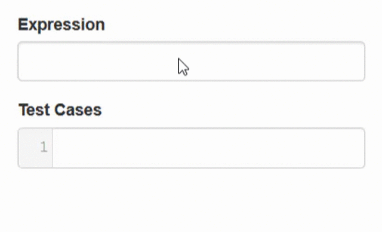

<!-- README.md is generated from README.Rmd. Please edit that file -->

```{r, include = FALSE}
knitr::opts_chunk$set(
	collapse = TRUE,
	comment = "#>",
	fig.path = "man/figures/README-",
	out.width = "100%"
)

options(width = "100")

require(shinyhighlightr)
```

# shinyhighlightr 

[](https://www.tidyverse.org/lifecycle/#experimental)
[](https://travis-ci.org/stefanieschneider/shinyhighlightr)
[](https://ci.appveyor.com/project/stefanieschneider/shinyhighlightr)

## Overview

This R package creates text markup input controls to highlight patterns in text values. It is highly inspired by the online regular expression tester and debugger [Regex101](https://regex101.com/). Two input fields are created: one to specify the expression to be marked; another where this expression is actually marked, e.g., in test cases for regular expressions. shinyhighlightr is built on top of [CodeMirror](https://github.com/codemirror/CodeMirror), a versatile text editor implemented in JavaScript. [Simple Regex Language](https://simple-regex.com/) strings can be used as input. There are mappings from English and German included.

## Installation

You can install the development version of shinyhighlightr from [GitHub](https://github.com/stefanieschneider/shinyhighlightr):

``` r
# install.packages("devtools")
devtools::install_github("stefanieschneider/shinyhighlightr")
```

## Usage

```{r example, message=FALSE, warning=FALSE}
if (interactive()) {
  library(shiny)
  library(shinyhighlightr)

  ui <- fluidPage(
    textMarkupInput(
      inputId = "highlight", labels = c("Expression", "Test Cases"),
      placeholder = c("Define Expression", "Define Test Cases"),
      values = list(
        "[1-2]{1}[0-9]{3}", 
        c(
          "19th century", "1855", 
          "between 1905 and 1910"
        )
      )
    ),
    div(
      class = "form-group shiny-input-container",
      actionButton("reset_expression", "Reset Expression"),
      actionButton("reset_test_cases", "Reset Test Cases")
    )
  )

  server <- function(input, output, session) {
    observeEvent(input$reset_expression, {
      updateTextMarkupInput(
        session, inputId = "highlight",
        labels = c("Expression Changed", NA),
        values = list("[1-2]{1}[7-8]{1}[0-9]{2}", NA),
        placeholders = c("Define Expression Changed", NA)
      )
    })
    
    observeEvent(input$reset_test_cases, {
      updateTextMarkupInput(
        session, inputId = "highlight",
        labels = c(NA, "Test Cases Changed"),
        values = list(NA, c("1750", "18th century")),
        placeholders = c(NA, "Define Test Cases Changed")
      )
    })
  }

  shinyApp(ui, server)
}
```

## Contributing

Please report issues, feature requests, and questions to the [GitHub issue tracker](https://github.com/stefanieschneider/shinyhighlightr/issues). We have a [Contributor Code of Conduct](https://github.com/stefanieschneider/shinyhighlightr/blob/master/CODE_OF_CONDUCT.md). By participating in shinyhighlightr you agree to abide by its terms.
